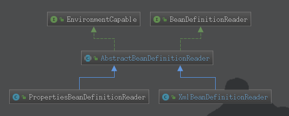

# Bean加载流程分析
## IOC容器的使用过程
* 获取资源
* 获取BeanFactory
* 根据新的BeanFactory创建一个BeanDefinitionReader对象,该Reader对象为资源的解析器
* 装载资源整个过程分为三个步骤:
    * 资源定位,可以参考上一节的[Resource资源加载分析](../Resource资源加载/Resource_Learning.md)
    * 装载:
        * 就是BeanDefinition的载入.**BeanDefinitionReader读取、解析Resource资源**
        * 将用户定义的Bean表示成IOC容器的内部数据结构(BeanDefinition)
        * IOC容器内维护了一个BeanDefinition Map的数据结构,配置文件中的每一个Bean都对应一个BeanDefinition对象
    * 注册:
        * 向IOC容器注册在第二步解析好的BeanDefinition,这个过程是通过BeanDefinitionRegistry接口来实现的
        * 在IOC容器内部其实是**将第二个装载过程解析得到的BeanDefinition注入一个HashMap中**
        * 这里需要注意,**上述过程并没有完全进行依赖注册**,而**依赖注册是发生在第一次调用getBean()向容器所要Bean的时候**
        * 可以通过设置预处理,即对某个Bean设置lazyinit属性,那么这个Bean的依赖注册就会在容器初始化的时候完成
## 主要接口和实现类

## 主要实现类
* PropertiesBeanDefinitionReader:用于解析properties的配置文件
* XmlBeanDefinitionReader
    * 主要方法 loadBeanDefinitions(Resource resource);
    * loadBeanDefinitions方法内部是调用了重载方法loadBeanDefinitions(EncodedResource resource)
    * 内部核心方法doLoadBeanDefinitions():
        1. 调用getValidationModeForResource()**[获取xml文件的验证模式](../获取验证模式/获取验证模式.md)**
        2. 调用loadDocument根据xml文件 **[获取对应的Document实例](../获取Document对象/获取Document实例.md)**
        3. 调用registerBeanDefinitions()**[注册Bean实例](../注册BeanDefinition/注册BeanDefinition.md)**
## 总结
* 首先通过文件配置文件的路径对资源进行定位加载,具体参考[Resource资源加载分析](../Resource资源加载/Resource_Learning.md)
* BeanDefinitionReader的主要作用是用于**从上一流程中的Resource资源中读取的Bean信息,并将其解析为BeanDefinition对象,注册到BeanDefinitionRegistry**
