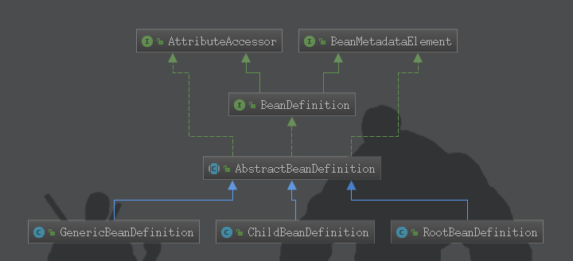

# Bean的解析
## BeanDefinition
* 概述: 
> BeanDefinition是一个接口,它描述了一个Bean实例,包括属性值、构造方法值和继承类的更多的信息.

* 接口关系:

* BeanDefinition继承 AttributeAccessor 和 BeanMetadataElement 接口:
    * AttributeAccessor:定义了与其它对象的(元数据)进行连接和访问的约定,即对属性的修改,包括获取、设置、删除
    * BeanMetadataElement:Bean元对象持有的配置元素可以通过getSource()方法来获取
## Bean解析流程

在上一节的[注册BeanDefinition](../注册BeanDefinition/注册BeanDefinition.md)中调用了parseBeanDefinitions方法:
* parseBeanDefinitions(Element root, BeanDefinitionParserDelegate delegate)流程简要分析:
---
    |parseDefaultElement(ele, delegate)
    |---|如果是Bean标签,则对Bean进行解析: processBeanDefinition(ele, delegate)
    |---|---|对元素进行解析: delegate.parseBeanDefinitionElement(ele)
    |---|---|---|解析属性,构造AbstractBeanDefinition: parseBeanDefinitionElement(ele, beanName, containingBean)
    |---|---|---|---|创建一个GenericBeanDefinition: BeanDefinitionReaderUtils.createBeanDefinition(parentName, className, this.readerContext.getBeanClassLoader())
    |---|---|---|对Bean标签中的属性进行解析: parseBeanDefinitionAttributes(ele, beanName, containingBean, bd)
    |---|---|---|解析元数据: parseMetaElements(ele, bd)
    |---|---|---|解析lookup-method属性: parseLookupOverrideSubElements(ele, bd.getMethodOverrides())
    |---|---|---|解析replaced-method属性: parseReplacedMethodSubElements(ele, bd.getMethodOverrides())
    |---|---|---|解析构造函数参数: parseConstructorArgElements(ele, bd)
    |---|---|---|解析property子元素: parsePropertyElements(ele, bd)
    |---|---|---|解析qualifier子元素: parseQualifierElements(ele, bd)
    |---|---|---|返回AbstractBeanDefinition
### bean标签解析
* meta: 元数据,当需要使用里面的信息时可以通过key获取
* lookup-method: 将一个方法声明为返回某种类型的bean,但实际返回的bean是在配置文件中进行配置的.该方法可用于设计一些可拔插的功能,解除程序依赖
    * [使用示例](../../src/main/java/com/clf/lookup_method)
* replaced-method: 可以在运行时调用新的方法替换现有的方法,还能动态的更新原由的方法的逻辑
    * [使用示例](../../src/main/java/com/clf/replaced_method)
