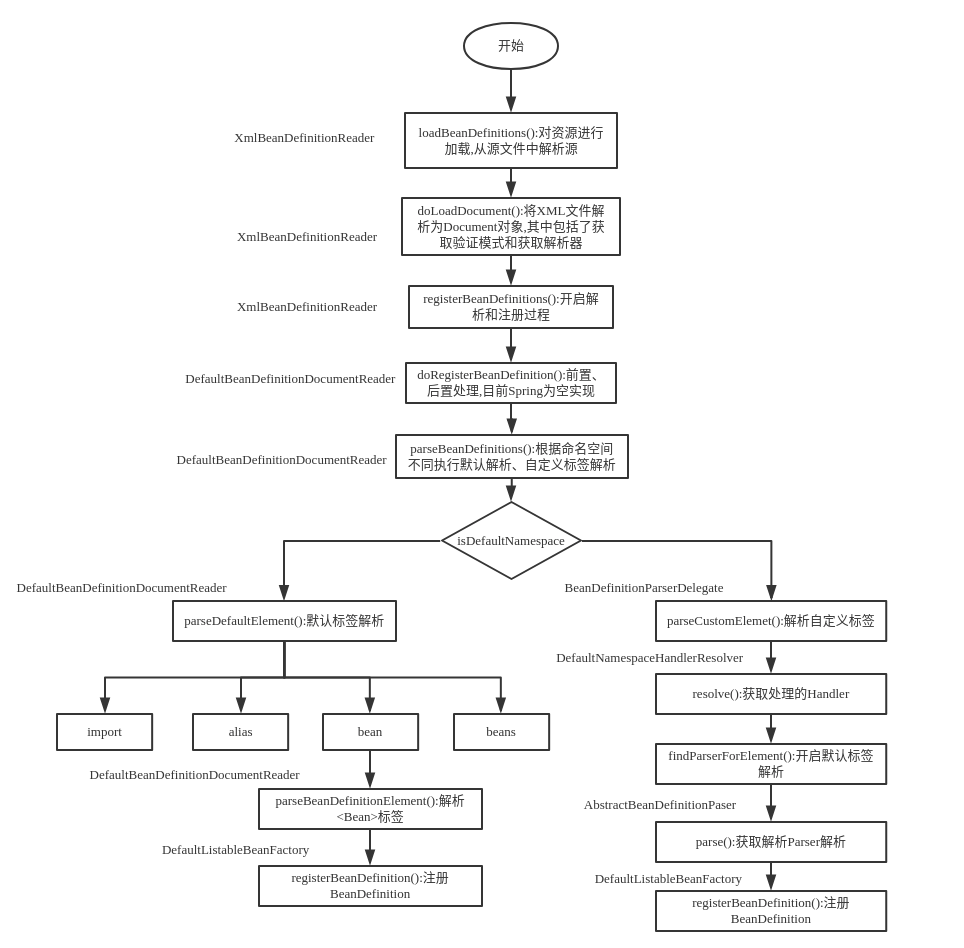

# IOC初始化总结
## 流程总结
从前面的流程中可以得出,IOC的初始化步骤主要分为三步: 
* [Resource定位加载](../Resource资源加载/Resource_Learning.md)
> 一般用外部资源描述Bean对象,所以在初始化IOC容器第一步就是需要定位到外部的资源文件
* [BeanDefinition的载入和解析(即Bean的解析)](../Bean的解析/Bean的解析.md)
>装载就是BeanDefinition的载入.BeanDefinition读取、解析Resource资源,也就是将用户定义的Bean表示成IOC容器内部数据结构:BeanDefinition.
在IOC容器中维护了一个BeanDefinition 的 HashMap 数据结构,在配置文件中每一个都对应一个BeanDefinition对象.
* [BeanDefinition注册](../注册BeanDefinition/注册BeanDefinition.md)
>向IOC容器注册在解析好BeanDefinition之后,通过BeanDefinitionRegistry接口来实现的.
这里的注册实际就是将上一步解析好的BeanDefinition对象注册到IOC内部的一个HashMap中进行维护.
需要注意:这里并没有对每一个进行依赖注入,依赖注入是发生在应用一次调用 getBean() 向容器索要Bean的时候.
可以在Bean的设置中添加 lazyinit 属性,那么这个Bean的依赖注入就会在容器初始化的时候就完成.
## 流程图

 