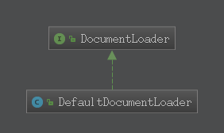

# 获取Document实例
## 核心方法
在XmlBeanDefinitionReader.doLoadDocument()方法中只做了三件事:
* 调用getEntityResolver()获取对应的解析器
* 调用getValidationModeForResource()[获取验证模式](../获取验证模式/获取验证模式.md)
* 调用DocumentLoader.loadDocument()获取Document对象
```
public interface DocumentLoader{
    Document loadDocument(
			InputSource inputSource, EntityResolver entityResolver,
			ErrorHandler errorHandler, int validationMode, boolean namespaceAware)
			throws Exception;
}
```
参数解释：
* inputSource:加载Document的Resource源
* entityResolver:解析文件的解析器
* errorHandler:处理加载Document对象的过程发生的错误
* validationMode:由getValidationModeForResource()方法[获取的验证模式](../获取验证模式/获取验证模式.md)
* namespaceAware:命名空间支持,如果要提供对XML名称空间的支持,则为true
### 默认实现类DefaultDocumentLoader

```java_holder_method_tree
    public Document loadDocument(InputSource inputSource, EntityResolver entityResolver,
			ErrorHandler errorHandler, int validationMode, boolean namespaceAware) throws Exception {

		//创建Document对象构建的工厂
		DocumentBuilderFactory factory = createDocumentBuilderFactory(validationMode, namespaceAware);
		if (logger.isDebugEnabled()) {
			logger.debug("Using JAXP provider [" + factory.getClass().getName() + "]");
		}
		//由工厂创建得到对应的builder
		DocumentBuilder builder = createDocumentBuilder(factory, entityResolver, errorHandler);
		//由builder对inputSource进行解析转换得到Document对象
		return builder.parse(inputSource);
	}
```
* 默认调用实现类DefaultDocumentLoader的方法:
    * 首先由createDocumentBuilderFactory()创建DocumentBuilderFactory
    * 再通过factory创建DocumentBuilder,最后解析InputSource得到对应的Document对象