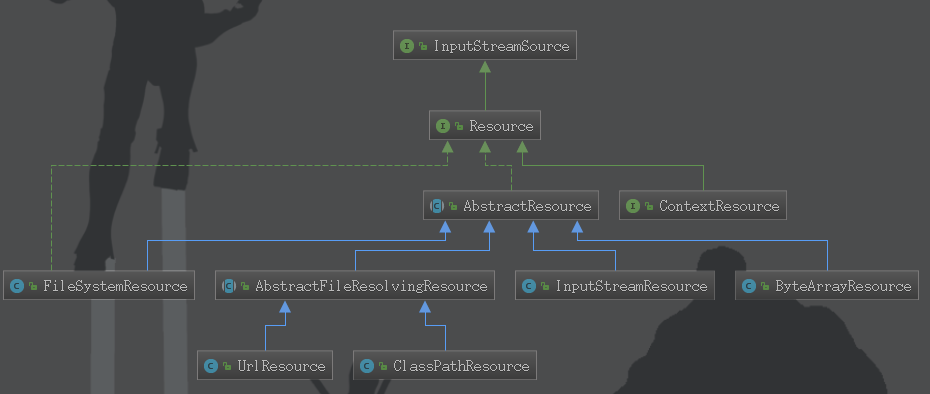
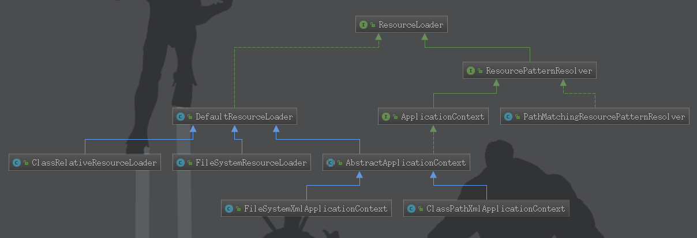
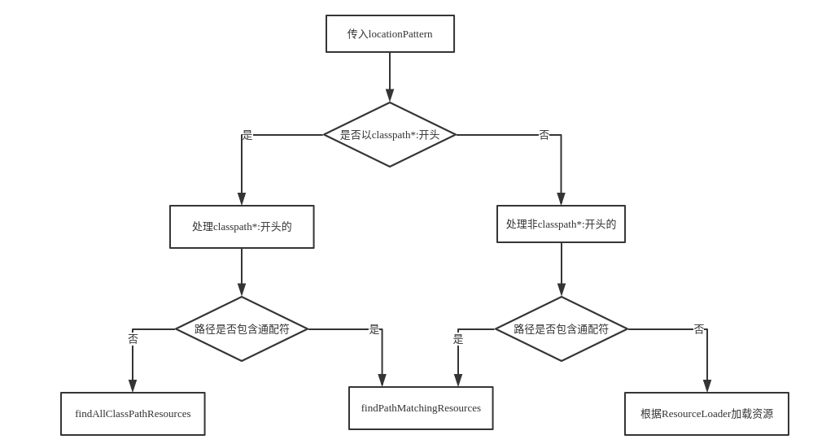

# IOC资源加载分析
## Resource资源定义接口分析

* InputStreamResource: 将给定的InputStream作为一种资源的Resource的实现类
* Resource接口简介:
    * 继承InputStreamSource接口
    * 是Spring框架**所有资源的抽象和访问接口**
    * 定义了一些通用的方法,由子类AbstractResource提供统一默认实现
* AbstractResource:
    * 为Resource接口的默认实现,即实现大部分的公共实现
### 继承AbstractResource的主要类
* FileSystemResource:
    * 实现WritableResource接口----->继承Resource接口
    * **对java.io.File类型资源文件的封装**
    * 从spring-framework-5.0开始,FileSystemResource使用NIO.2API进行读写交互
* ByteArrayResource:
    * **对字节数组提供的数据的封装**
    * 通过InputStream形式访问该类型的资源,该实现会根据字节数组构造一个对应的ByteArrayInputStream
* UrlResource:
    * **对java.net.URL类型资源的封装**
    * 内部委派URL进行具体的资源操作
* ClassPathResource:
    * **class path 类型的资源的实现**
    * 使用给定的ClassLoader或者给定的Class来加载资源
## ResourceLoader资源加载接口分析

* ResourceLoader接口简介:
    * 最为Spring资源加载的统一抽象,具体资源的加载由相应的实现类来完成
    * getResource():根据所提供的路径location返回Resource实例
    * getClassLoader():返回ClassLoader实例,对于想获取ResourceLoader使用ClassLoader用户来说,可以直接调用该方法获取
 * DefaultResourceLoader:
    * 是ResourceLoader的默认实现
    * 内部使用的ClassLoader默认为Thread.currentThread().getContextClassLoader()
    * 可以用过setClassLoader()进行设置
    * getResource(),核心方法实现:
    ```
        @Override
    	public Resource getResource(String location) {
    		Assert.notNull(location, "Location must not be null");
    
    		for (ProtocolResolver protocolResolver : this.protocolResolvers) {
    			//使用protocolResolvers来对资源进行加载
    			Resource resource = protocolResolver.resolve(location, this);
    			//成功就返回Resource,即当resource不为空时进行返回
    			if (resource != null) {
    				return resource;
    			}
    		}
    
    		if (location.startsWith("/")) {
    			//如果是以"/"开头,则调用getResourceByPath()构造ClassPathContextResource返回
    			return getResourceByPath(location);
    		}
    		//如果是以"classpath:"开头,就构造ClassPathResource进行返回
    		else if (location.startsWith(CLASSPATH_URL_PREFIX)) {
    			return new ClassPathResource(location.substring(CLASSPATH_URL_PREFIX.length()), getClassLoader());
    		}
    		else {
    			try {
    				//构造URL,尝试通过URL进行资源定位
    				URL url = new URL(location);
    				return new UrlResource(url);
    			}
    			catch (MalformedURLException ex) {
    				//如果加载过程异常,则委派getResourceByPath实现资源定位
    				return getResourceByPath(location);
    			}
    		}
    	}
    ```
* ResourcePatternResolver接口:
    * 这是一个对ResourceLoader接口的扩展
    * ResourceLoader的getResource方法是**只能根据location获取一个Resource**
    * 该接口能够通过getResources(),由一个locationPattern进行模糊匹配获取多个Resource
    * PathMatching实现ResourcePatternResolver的getResources()流程图:



## 总结
* Spring提供了Resource和ResourceLoader来统一抽象整个资源及其定位.
* **DefaultResource为Resource的默认实现**,它对Resource接口做了一个统一的实现
* **DefaultResourceLoader**同样也是**ResourceLoader的默认实现**
* DefaultResourceLoader每次只能返回单一的资源
* ResourceLoader的另一个接口**ResourcePatternResolver**可以根据locationPattern返回多个Resource
* PathMatchingResourcePatternResolver是一个集大成者的ResourceLoader
    * 既实现了Resource getResource(String location)
    * 也实现了Resource[] getResources(String locationPattern)